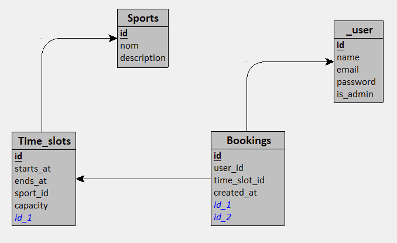

# &#128170; FitLife

## Contexte
Ce projet est l'objet du premier examen de cours de formation (ECF), dans le cadre de ma formation Concepteur Développeur d'Applications.
Il a été réalisé en une journée.

## Technologies
- Le projet a été réalisé à l'aide de Laravel (back-end = PHP, front-end = blade + tailwind).
- Breeze a également été installé afin de gérer l'authentification de manière plus efficace et sécurisée.
- Les maquettes ont été réalisées sur Figma.
- Les modèles (UML, MCD, MLD) ont été réalisés sur Looping.
- La base de données utilisée est sqlite.

## Déploiement
Afin de déployer le projet, entrer les commandes suivantes :
```
git clone https://github.com/Morgan-B3/ecf_1_Morgan_Boutrois.git

cd .\ecf1\

composer install

php artisan key:generate

composer run dev
```

Le site devrait normalement tourner à l'adresse suivante : http://127.0.0.1:8000/


## Génération des données
Afin de générer les données nécessaires au site, utiliser la commande suivante :
```
php artisan migrate --seed
```
Cela permettra de créer les tables ainsi que les données prédéfinies, à l'aide des fichiers présents dans database\migrations, database\factories et database\seeder.

Par défaut, un utilisateur est créé avec l'identifiant ```test@example.com``` et le mot de passe ```1234```

## Diagrammes de données
- Modèle conceptuel de données (MCD)

- Modèle logique de données (MLD)

- UML


## Maquettes
- Page d'accueil

- Page de reservation pour un cours

- Page d'affichage des reservations utilisateur

- Page d'administration des créneaux pour un cours

